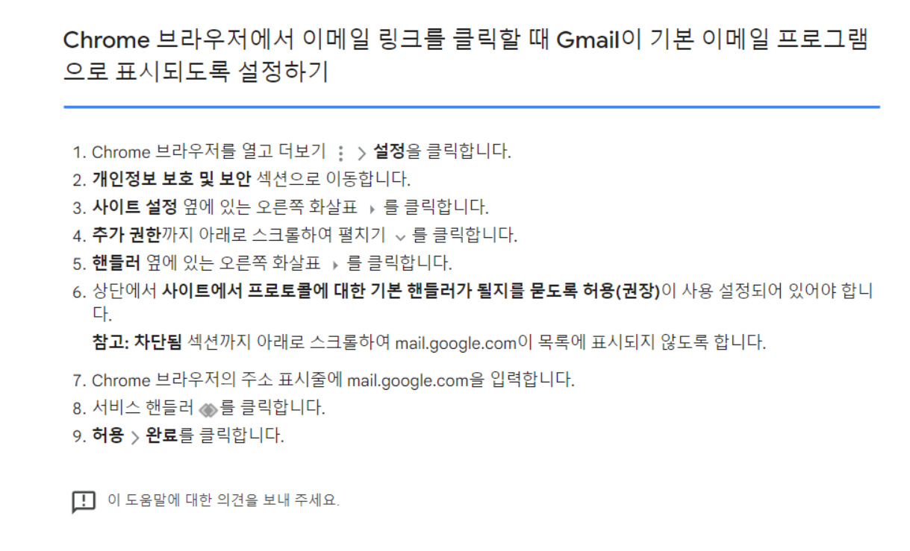

# Mailto teg

<a>태그 하이퍼링크에 메일링크(mailto:) 기본설명<br>
<br>
메일링크(mailto:)는 HTML 내에 클릭하면 메일을 보내는 기능을 갖게 하는 방법으로 <a> 앵커 태그에 내장해, 메일 소프트를 호출할 수 있도록 해준다.<br>
메일 수신인에 "xxxlata@test.com"을 지정하는 경우, 다음과 같이 기술한다. 

```<a href="mailto:"xxxlata@test.com">메일보내기</a>```
링크를 클릭하면 메일 보내기가 실행되고 메일 받는이인 "to:"에 "xxxlata@test.com"가 들어간 메일 신규 작성 화면이 열린다.
  
--------------------------------------------------------------------------
<a>태그 하이퍼링크에 메일링크(mailto:) 사용양식
<br><br>
메일링크 "mailto:"의 기능에는 몇개의 편리한 기능을 추가할 수 있다. 이러한 옵션에 의해서, "제목"등도 지정할 수 있다. 
<br><br>
메일제목 미리 넣어주기
```
<a href="mailto:xxxlata@test.com?subject=안녕하세요.">메일보내기</a>
```
cc 미리 넣어주기
```
<a href="mailto:xxxlata@test.com?cc=user@dammy.net">메일보내기</a>
```
bcc 미리 넣어주기
```
<a href="mailto:xxxlata@test.com?bcc=superman@test.com">메일보내기</a>
```
내용 본문 미리 넣어주기
```
<a href="mailto:xxxlata@test.com?body=안녕하세요.메일본문입니다.">메일보내기</a>
```
내용 본문 중 줄바꿈
```
<a href="mailto:xxxlata@test.com?body=[이름]%0D%0A[전화번호]">메일보내기</a>
```
복수항목을 같이 넣어주기
```
<a href="mailto:xxxlata@test.com?subject=설문조사&body=[이름]%0D%0A[성별]">메일보내기</a>
```
## Gmail로 연동하기

